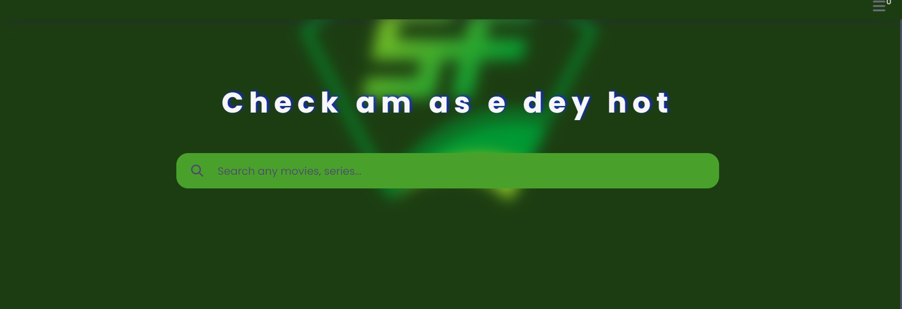

#Project description. This Project is a responsive web application that allows users to explore movies, search for their favorites, view detailed information, and create a personalized watchlist. The app leverages public movie APIs to fetch and display data dynamically.

Features and functionalities. Frontend Development: Visually appealing and user-friendly interface using HTML and CSS. Able to dynamically render movie data based on user interactions and API responses. Able to handle multiple API requests efficiently. Data Handling: Utilize array Ability to process and display data. Ability to implement interactive features such as search, filtering, and watchlist management.

Instructions on how to run the project locally. To run this project locally, download the zip file and etract it to your local server and run.

Technologies and APIs used. 
HTML, CSS, JAVASCRIPT. OMDB API

